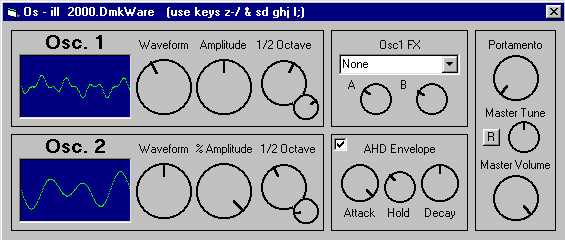



## Os \- ill Synthesizer \*UPDATED\*

### Description

Same 2 Osc. synth... NEW FEATURES: New waveforms, fine tuning knobs, master tuning knob, redesigned portamento, and redesigned interface... Also, osc2s amplitude is editable (again). however, its amplitude is based on osc1s amplitude. The finetuning knobs almost eliminate the 'square' sound the oscs used to make. I wish DirectSound could have 1 byte buffers, and it would be nice if VB could run a little faster... this way a floating point could be passed to the buffers instead of creating a whole 180 byte buffer (darnable clipping)... ::REMEMBER:: The newest knob OCX is included and must be registered. AND YOU MUST HAVE DIRECTX7
 
### More Info
 
may cause ear damage...

             |
---                |---
**Submitted On**   |2000-09-28 04:46:06
**By**             |[Dave Katrowski](https://github.com/Planet-Source-Code/PSCIndex/blob/master/ByAuthor/dave-katrowski.md)
**Level**          |Intermediate
**User Rating**    |5.0 (15 globes from 3 users)
**Compatibility**  |VB 5\.0, VB 6\.0
**Category**       |[Sound/MP3](https://github.com/Planet-Source-Code/PSCIndex/blob/master/ByCategory/sound-mp3__1-45.md)
**World**          |[Visual Basic](https://github.com/Planet-Source-Code/PSCIndex/blob/master/ByWorld/visual-basic.md)
**Archive File**   |[CODE\_UPLOAD102339282000\.zip](https://github.com/Planet-Source-Code/dave-katrowski-os-ill-synthesizer-updated__1-11727/archive/master.zip)

